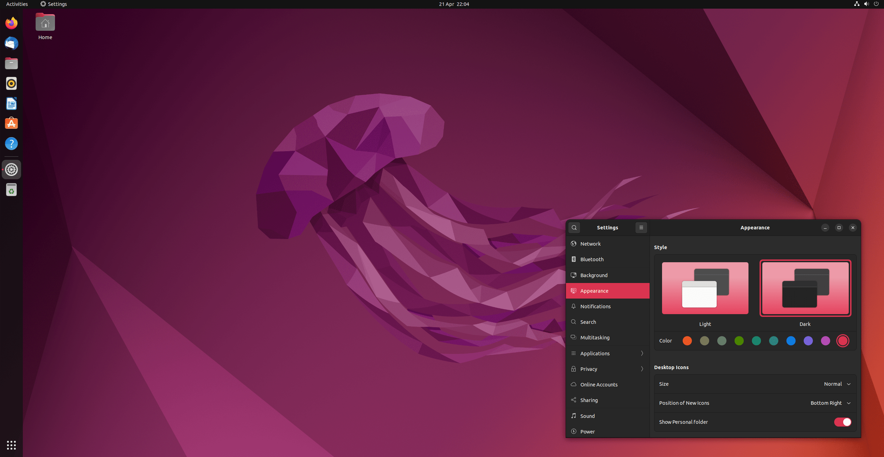
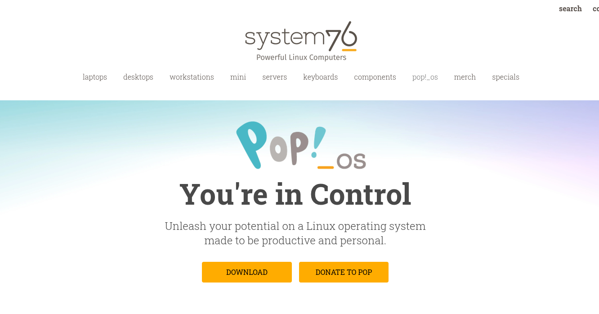
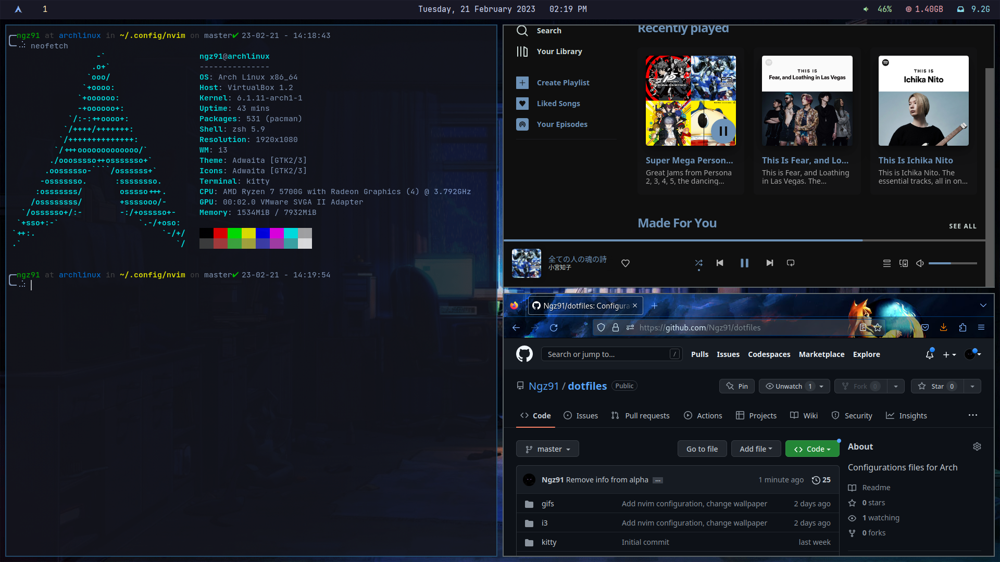

# Linux

Linux is common on servers and very popular among developers who want control.
Most of the internet is built on Linux.
Unavoidable over the long run.

## Pros

- Best match for the vast majority of production servers
- Great terminal experience
- Strong package managers
- Works well with open-source tools
- Maximum control over the machine.
- Fewer surprises

## Cons

- **You will probably break your machine at least once.**
- More responsibility on the user
- Hardware drivers can be annoying
- Some commercial apps have weaker support
- More confusing in general.

## Distributions

### [Ubuntu](https://ubuntu.com)

Good default choice for most students.

- Beginner-friendly
- Large community
- Lots of tutorials
- Common on servers

### [Pop!_OS](https://pop.system76.com)

Good Ubuntu-based option, especially for developer laptops.

- Friendly desktop experience
- Good hardware support
- Popular with technical users
- Has become increasingly popular.

### [Arch Linux](https://archlinux.org)

Important note:

> I use Arch btw.

Advanced option.

- Very customizable
- Excellent documentation
- Rolling release
- Easier to break if you do not know what you are doing

### [Omarchy](https://omarchy.org)

A more opinionated Arch-based setup.

Good for people who want a preconfigured developer environment, but probably not ideal as a first Linux experience during a hackathon.

---

# Summary

For the hackathon:

- Beginners should prefer browser-based tools
- Developers should prepare their local environment early
- Everyone should know how to run their project before the event
- Do not lose hackathon time fixing your operating system